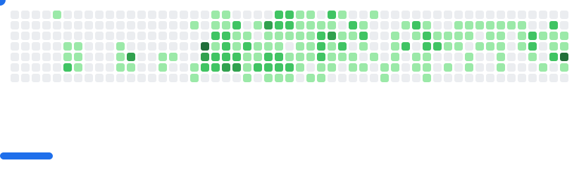

<h1 align="center">
  
  𝐇𝐞𝐥𝐥𝐨, &lt;𝚌𝚘𝚍𝚎𝚛𝚜/&gt;!
  
</h1>


<p></p>
<br/>
<br/>

- 🐣 My fullname is Vũ Minh Đức
- 🔭 I'm an information technology student in Vietnam.
- 👯 𝙸’𝚖 𝚕𝚘𝚘𝚔𝚒𝚗𝚐 𝚝𝚘 𝚌𝚘𝚕𝚕𝚊𝚋𝚘𝚛𝚊𝚝𝚎 𝚘𝚗 **Website, Design or DevOps .**
- 💬 𝙰𝚜𝚔 𝙼𝚎 𝙰𝚋𝚘𝚞𝚝 𝙰𝚗𝚢𝚝𝚑𝚒𝚗𝚐 ! 𝙸 𝚊𝚖 𝚑𝚊𝚙𝚙𝚢 𝚝𝚘 𝚑𝚎𝚕𝚙.
- 😄 𝙿𝚛𝚘𝚗𝚘𝚞𝚗𝚜 : **𝙷𝚎/𝙷𝚒𝚖/𝙷𝚒𝚜.**
- ⚡ 𝙵𝚞𝚗 𝚏𝚊𝚌𝚝 : **𝙱𝚎𝚜𝚝 𝙿𝚊𝚛𝚝 𝙾𝚏 𝚃𝚑𝚎 𝙹𝚘𝚞𝚛𝚗𝚎𝚢 𝙸𝚜 : *𝙸𝚝 𝙴𝚗𝚍𝚜.***

<br/>
<br/>
<br/>


#

<p align="center">
  
  
  
</p>

#

**Tech Universe**
<div align="center">
  
  
  
  
  
  
  
  
  
  
  
  
  
  
  
  
  
  
  
  
  
  
  
  
  
  
</div>

---

**My Stack & Tools**

<div align="center">
  
  <br><br>
  
  
  
</div>
<br/>

#


<br>

### 📈 GitHub Analytics & Streak

<div align="center">

  <a href="https://github.com/anuraghazra/github-readme-stats">
    
  </a>
  
  <a href="https://github.com/anuraghazra/github-readme-stats">
    
  </a>

  <br>

<a href="https://github.com/denvercoder1/github-readme-streak-stats">
  
</a>

</div>

---


<h4 align="center">
  
```diff
+@ @ @ @ @ @ @ @ @ @ @ @ @ @ @ @ @ @ @ @ @ @ @ @ @ @ @ @+
@@       o o                                           @@
@@       | |                                           @@
@@      _L_L_                                          @@
@@   ❮\/__-__\/❯ Programming isn't about what you know @@
@@   ❮(|~o.o~|)❯  It's about what you can figure out   @@
@@   ❮/ \`-'/ \❯                                       @@
@@     _/`U'\_                                         @@
@@    ( .   . )     .----------------------------.     @@
@@   / /     \ \    | while( ! (succeed=try() ) ) |     @@
@@   \ |  ,  | /    '----------------------------'     @@
@@    \|=====|/                                        @@
@@     |_.^._|                                         @@
@@     | |"| |                                         @@
@@     ( ) ( )   Testing leads to failure              @@
@@     |_| |_|   and failure leads to understanding    @@
@@ _.-' _j L_ '-._                                     @@
@@(___.'     '.___)                                    @@
+@ @ @ @ @ @ @ @ @ @ @ @ @ @ @ @ @ @ @ @ @ @ @ @ @ @ @ @+
```

</h4>  
  

<br/>


#
<br>
**I'm a Night 🦉** 

```text
🌞 Morning    93 commits     ██░░░░░░░░░░░░░░░░░░░░░░░   9.22% 
🌆 Daytime    274 commits    ██████░░░░░░░░░░░░░░░░░░░   27.16% 
🌃 Evening    396 commits    █████████░░░░░░░░░░░░░░░░   39.25% 
🌙 Night      246 commits    ██████░░░░░░░░░░░░░░░░░░░   24.38%

```


#

<picture align="center">
  <source
    media="(prefers-color-scheme: dark)"
    srcset="breakout/dark.svg"
  />
  <source
    media="(prefers-color-scheme: light)"
    srcset="breakout/light.svg"
  />
  
</picture>

<p align="center">
  
</p>


<div align="center">
  
</div>

<div align="center">
  
</div>
<div align="center">

### 𝚂𝚑𝚘𝚠 𝚜𝚘𝚖𝚎 ❤️ 𝚋𝚢 𝚜𝚝𝚊𝚛𝚛𝚒𝚗𝚐 𝚜𝚘𝚖𝚎 𝚘𝚏 𝚝𝚑𝚎 𝚛𝚎𝚙𝚘𝚜𝚒𝚝𝚘𝚛𝚒𝚎𝚜!

</div>

#


